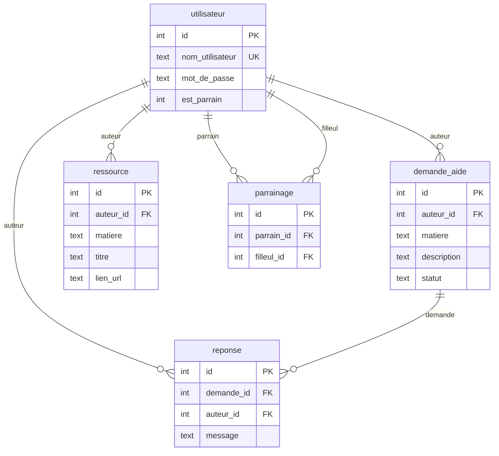

# Luminy-Connect — Documentation du projet (révision examen)

Application web **Flask** + **SQLite** : plateforme d’entraide entre étudiants (demandes d’aide, réponses, ressources partagées, parrainage). Les pages sont rendues côté serveur avec des templates **Jinja2** (`templates/`) et le style dans `static/style.css`.

---

## 1. Schéma simple de l’architecture

```
Navigateur  →  requêtes HTTP  →  app.py (routes Flask)
                                      │
                                      ├─ session (cookie signé : user_id, nom, est_parrain)
                                      ├─ @login_required (data_model)
                                      └─ appelle data_model.py (requêtes SQL)
                                              │
                                              └─ luminy_connect.sqlite (SQLite)
```

**Fichiers principaux**

| Fichier | Rôle |
|---------|------|
| `app.py` | Point d’entrée Flask : URLs, formulaires, redirections, rendu des pages |
| `data_model.py` | Accès base de données + auth (hachage mot de passe) + décorateur `login_required` |
| `create_db.py` | Création des tables (`init_db`) |
| `luminy_connect.sqlite` | Fichier de la base de données |

---

## 2. Modèle de données (tables et relations)

### Schéma relationnel (vue d’ensemble)



### Détail table par table

**`utilisateur`**

- `id` : identifiant unique (clé primaire, auto-incrémenté).
- `nom_utilisateur` : unique, obligatoire (connexion).
- `mot_de_passe` : **stocké haché** (jamais en clair) via Werkzeug.
- `est_parrain` : `1` si l’utilisateur s’est déclaré « étudiant expérimenté » (éligible comme parrain), sinon `0`.

**`demande_aide`**

- `auteur_id` : référence `utilisateur(id)`.
- `matiere`, `description` : contenu de la demande.
- `statut` : par défaut `'ouverte'` ; la clôture met `'close'` (voir `cloturer_demande`).

**`reponse`**

- `demande_id` → `demande_aide(id)`.
- `auteur_id` → `utilisateur(id)`.
- `message` : texte de la réponse.

**`parrainage`**

- Lien **parrain** (`parrain_id`) ↔ **filleul** (`filleul_id`), tous deux vers `utilisateur`.
- Une ligne = une relation de parrainage attribuée.

**`ressource`**

- Lien partagé (`lien_url`) avec `matiere`, `titre`, et `auteur_id`.

---

## 3. Fonctions dans `data_model.py`

### Accès générique à la base

- **`db_fetch(query, args, fetch_all=False)`** : exécute une requête `SELECT`. Si `fetch_all=True`, retourne une **liste de dictionnaires** ; sinon **un dictionnaire** ou `None`.
- **`db_insert(query, args)`** : `INSERT`, `commit`, retourne **`lastrowid`** (souvent l’`id` créé).
- **`db_run(query, args)`** : exécute une requête avec `commit` (sans valeur de retour utile ici).
- **`db_update(query, args)`** : `UPDATE`/`DELETE` avec `commit`, retourne **`rowcount`** (nombre de lignes affectées).

### Sécurité et session

- **`login_required(f)`** : **décorateur**. Si `session` ne contient pas `user_id`, redirection vers la page `connexion` ; sinon exécution de la vue `f`. Utilisé sur presque toutes les routes « privées ».

### Authentification / inscription

- **`inscrire_utilisateur(nom_utilisateur, mot_de_passe, est_parrain)`** : hache le mot de passe, insère dans `utilisateur`. Retourne le nouvel `id`, ou **`-1`** si le nom existe déjà (`IntegrityError` sur `UNIQUE`).
- **`authentifier_utilisateur(nom_utilisateur, mot_de_passe)`** : charge l’utilisateur par nom, vérifie le mot de passe avec **`check_password_hash`**. Retourne `{'id', 'est_parrain'}` ou **`-1`** si échec.
- **`valider_mot_de_passe(mdp)`** : retourne `(True, message)` ou `(False, message)` selon : longueur ≥ 8, au moins une majuscule, un chiffre, un caractère spécial.

### Demandes d’aide

- **`obtenir_demandes()`** : toutes les demandes avec **JOIN** sur `utilisateur` pour afficher le nom de l’auteur, tri décroissant par `id`.
- **`obtenir_matieres()`** : matières **distinctes** issues de `demande_aide` **UNION** `ressource`, triées.
- **`chercher_demandes(q, matiere)`** : filtre optionnel par matière exacte et/ou recherche **LIKE** (insensible à la casse) sur matière + description.
- **`get_demande(demande_id)`** : une demande avec auteur.
- **`creer_demande(auteur_id, matiere, description)`** : insertion, retourne l’`id` de la demande.
- **`cloturer_demande(demande_id, auteur_id)`** : met `statut = 'close'` **seulement** si l’`auteur_id` correspond (sécurité : pas de clôture par un tiers).

### Réponses

- **`get_reponses(demande_id)`** : toutes les réponses d’une demande avec nom d’auteur, ordre croissant par `id`.
- **`creer_reponse(demande_id, auteur_id, message)`** : ajoute une réponse.
- **`get_reponses_de(user_id)`** : toutes les réponses **écrites par** un utilisateur, avec infos sur la demande associée (pour le profil public).

### Ressources

- **`obtenir_ressources()`** : liste des ressources avec auteur.
- **`ajouter_ressource(auteur_id, matiere, titre, lien_url)`** : insertion.

### Parrainage

- **`creer_parrainage(parrain_id, filleul_id)`** : nouvelle ligne dans `parrainage`.
- **`obtenir_parrain_de(filleul_id)`** : le parrain du filleul (ou `None`).
- **`obtenir_filleuls_de(parrain_id)`** : liste des filleuls d’un parrain.
- **`get_parrain_disponible(filleul_id)`** : parmi les utilisateurs avec `est_parrain = 1`, **exclut** ceux qui parrainnent déjà ce filleul ; compte les filleuls par parrain ; retourne le parrain avec le **moins** de filleuls (`ORDER BY nb_filleuls ASC LIMIT 1`). Sert à **répartir** la charge.

### Profil / stats

- **`get_utilisateur(user_id)`** : `id`, `nom_utilisateur`, `est_parrain` (données « publiques » affichables).
- **`get_stats_utilisateur(user_id)`** : dictionnaire avec le nombre de demandes, réponses et ressources créées par cet utilisateur (`COUNT` sur chaque table).
- **`obtenir_demandes_de(user_id)`** : demandes créées par l’utilisateur (profil connecté).

---

## 4. Routes et logique dans `app.py`

| URL (méthodes) | Fonction | Protection | Rôle |
|----------------|----------|------------|------|
| `/connexion` GET | `connexion` | non | Formulaire connexion ; si déjà connecté → accueil |
| `/connexion` POST | `connexion_post` | non | Lit `nom_utilisateur`, `mot_de_passe` ; `authentifier_utilisateur` ; remplit `session` (`user_id`, `est_parrain`, `nom`) |
| `/inscription` POST | `inscription` | non | Valide le mot de passe, `inscrire_utilisateur`, session, ou erreur avec `active_tab='inscription'` |
| `/deconnexion` | `deconnexion` | non | `session.clear()` |
| `/` GET | `accueil` | `@login_required` | Paramètres `q`, `matiere` : si l’un est présent → `chercher_demandes`, sinon `obtenir_demandes` ; `obtenir_matieres()` pour les filtres |
| `/nouvelle-demande` GET/POST | `nouvelle_demande_*` | oui | GET : formulaire ; POST : `creer_demande` avec `session['user_id']` |
| `/demande/<id>` GET | `detail_demande` | oui | `get_demande` + `get_reponses` |
| `/demande/<id>/repondre` POST | `repondre` | oui | `creer_reponse` |
| `/demande/<id>/cloturer` POST | `cloturer` | oui | `cloturer_demande` (auteur uniquement côté SQL) |
| `/ressources` GET | `ressources` | oui | Liste `obtenir_ressources()` |
| `/ajouter-ressource` GET/POST | `ajouter_ressource_*` | oui | POST : `ajouter_ressource` |
| `/mon-parrainage` GET | `mon_parrainage` | oui | Si parrain : `obtenir_filleuls_de` ; sinon : `obtenir_parrain_de` |
| `/demander-parrain` POST | `demander_parrain` | oui | `get_parrain_disponible` puis si trouvé `creer_parrainage(parrain['id'], user)` |
| `/profil` GET | `profil` | oui | Profil de l’utilisateur connecté : user, stats, ses demandes |
| `/utilisateur/<user_id>` GET | `profil_public` | oui | Profil d’un autre user : stats + `get_reponses_de` ; si user inexistant → accueil |

**Session Flask** : `secret_key` dans `app.py` sert à **signer** le cookie de session (indispensable en production : utiliser une clé secrète forte et variable d’environnement).

**Démarrage** : `if __name__ == '__main__'` appelle `init_db()` puis `app.run(debug=True)` pour créer les tables si besoin et lancer le serveur de développement.

---

## 5. `create_db.py`

- **`init_db()`** : exécute des `CREATE TABLE IF NOT EXISTS` pour les 5 tables avec les **clés étrangères** (`FOREIGN KEY`) vers `utilisateur` ou `demande_aide`.
- **`db_run`** local : même idée que dans `data_model` (connexion, exécution, commit).

---

## 6. Templates (aperçu)

- **`en_tete.html`** : barre de navigation ; liens différents si `session.user_id` présent.
- **`pied_de_page.html`** : pied de page commun.
- **`accueil.html`** : liste des demandes + filtres matière / recherche.
- **`creer_demande.html`**, **`detail_demande.html`**, **`ressources.html`**, **`ajouter_ressource.html`**, **`parrainage.html`**, **`profil.html`**, **`profil_public.html`**, **`connexion.html`** : pages correspondant aux routes ci-dessus.

Les formulaires envoient en **POST** des champs nommés (`nom_utilisateur`, `mot_de_passe`, `matiere`, `description`, `message`, etc.) lus via `request.form` dans `app.py`.

---

## 7. Idées à retenir pour l’oral

1. **Séparation des rôles** : `app.py` = HTTP et navigation ; `data_model.py` = SQL et règles métier réutilisables ; `create_db.py` = schéma.
2. **Sécurité** : mots de passe hachés ; requêtes paramétrées `(?, ?)` contre l’injection SQL ; clôture de demande conditionnée à l’auteur ; pages sensibles protégées par `@login_required`.
3. **Relations SQL** : `JOIN` pour afficher le **nom** à partir des `id` ; `UNION` pour fusionner des listes de matières ; sous-requête dans `get_parrain_disponible` pour exclure certains parrains.
4. **État utilisateur** : la session mémorise qui est connecté sans stocker le mot de passe dans le cookie (seulement des données signées côté Flask).

Bon courage pour ton test.
